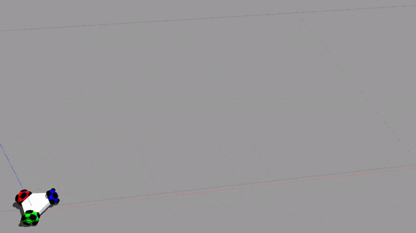

# CP275_HWS
This course provides an end-to-end overview of different topics involved in designing or analyzing autonomous systems. It begins with different formal modeling frameworks used for autonomous systems including state-space representations (difference equations), hybrid automata, and in general labeled transition systems. It also discusses different ways of formally modeling properties of interest for such systems such as stability, invariance, reachability, and temporal logic properties. 

After this, the course covers different techniques on the verification of such systems including Lyapunov functions, reachability, barrier certificates, and potentially model checking. Finally, the course will introduce students to several techniques for designing controllers enforcing properties of interest over autonomous systems.

---

## Final Term Paper

Study, Implement and Extend the following work 
> Rodionova, Alena, Lars Lindemann, Manfred Morari and George J. Pappas. “Time-Robust Control for STL Specifications.” 2021 60th IEEE Conference on Decision and Control (CDC) (2021): 572-579.

The code can be found in [time-robust-control](/time-robust-control)

### Extentions (Our Work)

**Problems with current literature**
- Control inputs are abrupt, leading to highly jerky state trajectories
  - [x] Solution: Perform L2 regularization of inputs
- Computational time is very high
  - [ ] Solution: Might not be possible to reduce solving time due to the nature of optimization problem (Mixed Integer Quadratic Program)

**Results after implementing above changes for a Multi Agent 3D UAV system**
- N_states = 24
- N_control = 8
- Horizon = 50
- High Level Specification: Reach goal region always within the last 10 timesteps

|     | Time Robust Control | Convex MPC |
| :-: | :-----------------: | :--------: |
|     |  |  |
| Solver Time (secs) | 44 | 0.01 |
| Time Robustness (`dt` units) | 1 | Does not exist |
| Trajectory | Little Jerky | Smooth |

## Fine Lab Exam

**Aim:** Design and Implement a Controller for a three-wheeled omnidirectional robot to satisfy a given Signal Temporal Logic Specification (STL).

The code can be found in [funnel_control_stl](/funnel_control_stl/funnel_control_omni3.py). The implemented controller is inspired from [^1] and [^2]

[^1]: L. Lindemann, C. K. Verginis and D. V. Dimarogonas, "Prescribed performance control for signal temporal logic specifications," 2017 IEEE 56th Annual Conference on Decision and Control (CDC), Melbourne, VIC, Australia, 2017, pp. 2997-3002, doi: 10.1109/CDC.2017.8264095.
[^2]: M. Sewlia, C. K. Verginis and D. V. Dimarogonas, "Cooperative Object Manipulation Under Signal Temporal Logic Tasks and Uncertain Dynamics," in IEEE Robotics and Automation Letters, vol. 7, no. 4, pp. 11561-11568, Oct. 2022, doi: 10.1109/LRA.2022.3200760.

### Simulation

SimGoalRegion1: [0.60, 0.645] x [0.15, 0.20]

SimGoalRegion2: [0.10, 0.145] x [0.80, 0.85]

SimSTL: $[F_{[10,25]}SimGoalRegion1] \wedge [F_{[35,50]}SimGoalRegion2]$ 

### Hardware

GoalRegion1: [3.0, 3.45] x [1.5, 2.0]

GoalRegion2: [1.0, 1.45] x [4.0, 4.5]

STL: $[F_{[20,25]}GoalRegion1] \wedge [F_{[35,50]}GoalRegion2]$ 

In the code uncomment the lines that subscribe the pose obtained from the MoCap system.

Unfortunately I don't have the video of hardware result since it was an exam :( 
